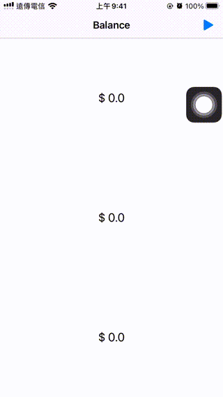

# WWBankBalanceAnimationLabel
[](https://developer.apple.com/swift/) [](https://developer.apple.com/swift/) [](https://developer.apple.com/swift/) [](https://developer.apple.com/swift/)

UILabel text animation.
UILabel文字動畫.



### [Installation with Swift Package Manager](https://medium.com/彼得潘的-swift-ios-app-開發問題解答集/使用-spm-安裝第三方套件-xcode-11-新功能-2c4ffcf85b4b)
```
dependencies: [
    .package(url: "https://github.com/William-Weng/WWBankBalanceAnimationLabel.git", .upToNextMajor(from: "1.0.0"))
]
```

### Example
```swift
import UIKit
import WWPrint
import WWBankBalanceAnimationLabel

final class ViewController: UIViewController {
    
    @IBOutlet weak var label1: WWBankBalanceAnimationLabel!
    @IBOutlet weak var label2: WWBankBalanceAnimationLabel!
    @IBOutlet weak var label3: WWBankBalanceAnimationLabel!
    
    override func viewDidLoad() {
        super.viewDidLoad()
    }
    
    @IBAction func running(_ sender: UIBarButtonItem) {
        
        label1.balance(from: 0, to: 100_000_000, format: "TWD. %.0f") { value in
            wwPrint(value)
        } completion: { isCompletion in
            wwPrint(isCompletion)
        }
        
        label2.balance(to: 123456.56789, duration: 3.0, format: "CNY. %.5f", runloop: .current, forMode: .common)
        
        label3.balance(to: 200_000_000, duration: 5.0, format: "USD. %.1f")
    }
}
```
